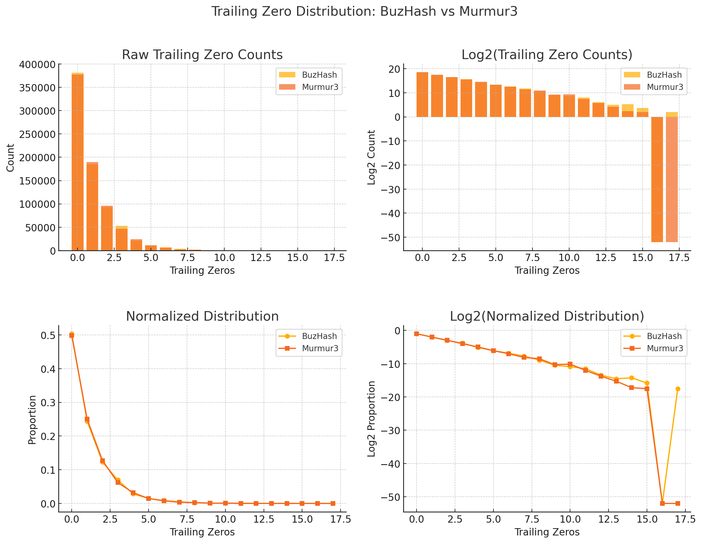

# buzhash

A blazing-fast, zero-allocation **rolling hash** library in pure Go (with optional cgo boost), built for high-performance sliding window applications like phrase detection, content matching, and chunk-based processing.

Inspired by the original [BuzHash](https://en.wikipedia.org/wiki/Rolling_hash#BuzHash) design, this implementation:

- Is optimized for fixed-length phrase hashing and rolling forward efficiently
- Supports both one-shot and windowed rolling APIs
- Implements `hash.Hash64` for optional interoperability (but is not a streaming hash)
- Offers an optional native `cgo` backend for even faster performance

---

## Features

- **Zero allocations** for `Roll(1)`
- **Incremental window hashing** for sliding window detection
- `BulkRoll(stride)` for SIMD-style batch performance
- Optional `cgo`-powered backend for 15–30% speed boost
- Go-native and GC-friendly, even when rolling over megabyte buffers

---

## When to Use

This is a hash function built specifically for **rolling or sliding window hashing** use cases.

Use `buzhash` if:
- You're scanning a large buffer for **repeated or known phrases**
- You're performing **chunk boundary detection** (e.g., for deduplication or sync)
- You want **fixed-cost per window**, regardless of overlap
- You care about **speed more than entropy**

Do *not* use `buzhash` as a drop-in replacement for Murmur3, SHA256, or xxHash:
- It is **not cryptographic**
- It does not provide strong avalanche properties for full-file hashing
- It is not collision-resistant across large files

For full-file hashing or where entropy matters more than speed, consider [murmur3](https://pkg.go.dev/github.com/spaolacci/murmur3) or [xxhash](https://pkg.go.dev/github.com/cespare/xxhash). For smaller phrases sliding across the large data (ideal use case for buzhash), buzhash performs at par with murmur3 in terms of statistical properties and provides a significant (~6x) performance improvement as shown below.

---

## Install

```bash
go get github.com/satmihir/buzhash
```

To enable the optional `cgo` fast path:
```bash
CGO_ENABLED=1 go test -tags cgo -bench=.
```

---

## Quick Example

```go
import "github.com/satmihir/buzhash"

// Hash a single buffer
hash := buzhash.Hash([]byte("foobar"))

// Create a rolling hasher
h, err := buzhash.New([]byte("hello world"), 4)
if err != nil {
    log.Fatal(err)
}

// Roll forward by 1 byte
next, _ := h.Roll(1)

// Get multiple window hashes with stride 1
hashes, _ := h.BulkRoll(1)
```

---

## Benchmark

Tested on macOS (Apple M1 Pro, Go 1.22) with a 754 KB buffer and 6-byte rolling window:

| Method                  | Time/op    | Speedup vs Murmur3 | Notes                     |
|-------------------------|------------|---------------------|---------------------------|
| `Murmur3` (6B input)    | 7.62 ms    | 1x                  | Non-rolling baseline      |
| `buzhash.Hash()`        | 4.00 ms    | ~1.9x               | Recomputing each window   |
| `Roll(1)`               | 2.84 ms    | ~2.7x               | Uses incremental rolling  |
| `BulkRoll(1)` (cgo)     | 1.37 ms    | ~5.6x               | Fastest path              |

> `BulkRoll()` uses true rolling logic under the hood. The cgo version avoids Go-loop overhead and is ~15–30% faster.

---

## Entropy and Distribution


<br />

BuzHash is not just fast — it's statistically solid for its target use cases:

- **Uniformity over 65,536 bins**:
  - Mean: 11.56, StdDev: 33.00 (Murmur3: 32.95)
  - Virtually identical spread across bins

- **Bit entropy per bit**:
  - All 64 bits ≥ 0.9996 entropy (Murmur3: same range)
  - No significant bias, excellent for masking, filtering, MPH

- **Trailing zero decay** (used in chunking):
  - Clean exponential decay pattern
  - Comparable to Murmur3 across all 0–15 trailing zero cases
  - Tiny tail deviation at 14+ zeros (expected noise)

> These statistical properties confirm BuzHash is suitable for use in hash maps, rolling fingerprints, and content-defined chunking.

---

## License

MIT
